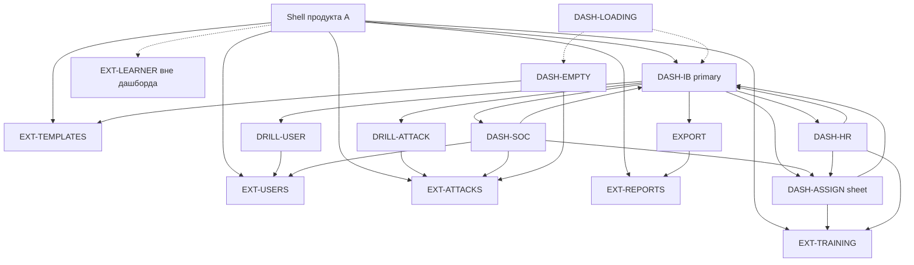

# IA — Сводный дашборд программы «А»

Навигационная истина **только для сводного дашборда** и связанных переходов.
Узла или перехода, которого нет здесь, в прототипе дашборда не существует.
Существующие разделы продукта А — **внешние узлы** (не проектируются заново).

## Решения человека (зафиксированы)

1. Первый экран = **последняя кампания / актуальный срез**. Переключателя 3–6–12 месяцев на первом экране **нет**.
2. Сравнение подразделений **без** порога «плохо» / traffic-light.
3. **HR-срез** = только обучение / образование.
4. **SOC-срез** = уязвимые + частые инциденты.
5. **ФИО** топа уязвимых — на сводке (с ролевым ограничением PII).
6. **Нет** dual-mode «ИБ / руководство» на одной странице.
7. Дашборд **≠** раздел Отчёты: отдельные узлы; переход в Отчёты — внешний.

## 1. Модель навигации

| Слой | Роль | Вход | Выход |
|------|------|------|-------|
| Корень продукта | shell + глобальная навигация разделов А | логин / deep-link | смена раздела (внешние узлы) |
| Страница | primary дашборд ИБ или срез HR/SOC | пункт «Сводная аналитика» / роль | смена раздела; срез; экспорт; drill |
| Панель (sheet) | короткое действие в контексте | CTA «Назначить обучение» с топа/сводки | закрыть / подтвердить → остаёмся на сводке |
| Внешний узел | существующий раздел А | drill / CTA «в раздел» | назад в продукт (вне scope) |

Правила:
- Таббара мобильного нет: desktop shell с боковой/верхней навигацией разделов.
- Push-стек внутри дашборда минимален: primary ↔ срезы ↔ sheet. Глубокая сущность уходит во **внешний** раздел.
- Системный «назад» из sheet закрывает sheet. Из среза HR/SOC — возврат на primary (ИБ) или на shell-навигацию (если роль landится сразу в срез).
- Dual-mode toggle ИБ/руководство **запрещён**. Экспорт закрывает потребность зрителей CISO.

### Primary vs secondary

| Уровень | Узлы |
|---------|------|
| **Primary** | `DASH-IB` — сводка ИБ (актуальный срез) |
| **Secondary (срезы)** | `DASH-HR`, `DASH-SOC` |
| **Transient** | `DASH-EMPTY`, `DASH-LOADING`, `DASH-ASSIGN` (sheet) |
| **Внешние** | Пользователи, Атаки, Шаблоны, Обучение, Отчёты, кабинет учащегося |

## 2. Таблица узлов

### Primary / состояния

| ID | Что это | Зачем | Когда появляется | Куда ведёт каждый интерактив |
|----|---------|-------|------------------|------------------------------|
| **DASH-IB** | Сводный дашборд ИБ: Risk Score, атаки последней кампании, обучение, топ ФИО, подразделения, метаданные кампании, CTA, экспорт | J1–J7: одна актуальная картина без Excel | Есть ≥1 кампания (или org-срез с данными); роль ИБ / зритель с доступом к сводке | Risk Score блок → остаёмся (пояснение/распределение на месте). Метрика атаки / «детали кампании» → **EXT-ATTACKS** (карточка/список атаки). Строка топа ФИО → **EXT-USERS** (карточка пользователя) *или* CTA → **DASH-ASSIGN**. CTA «Назначить обучение» (сводный/топ) → **DASH-ASSIGN**. Блок обучения «все курсы / модуль» → **EXT-TRAINING**. Подразделение (строка сравнения) → остаёмся (без порога) *или* drill в **EXT-USERS** с фильтром подразделения [Should]. «Экспорт» → файл/диалог экспорта (остаёмся) *и/или* **EXT-REPORTS** если нужен schedule/архив. Переключатель среза HR → **DASH-HR** [если роль/доступ]. Переключатель среза SOC → **DASH-SOC**. Пункты shell: Пользователи/Атаки/Шаблоны/Обучение/Отчёты → соответствующие EXT-*. Нет переключателя 3–6–12. |
| **DASH-EMPTY** | Пустое состояние сводки | Объяснить отсутствие данных и куда идти | Нет кампаний / нет данных для среза | CTA «Создать / запустить кампанию» → **EXT-ATTACKS** (или мастер атак, внешний). CTA «К шаблонам» → **EXT-TEMPLATES**. Навигация shell — как обычно. Экспорт недоступен / disabled. |
| **DASH-LOADING** | Скелетон/ожидание загрузки сводки | Не имитировать «ручную сборку» пустым UI | Пока грузятся метрики актуального среза | Интерактивов нет (или только shell). Ошибка загрузки → retry на месте *или* сообщение + ссылка в **EXT-REPORTS** [Could]. |

### Secondary срезы

| ID | Что это | Зачем | Когда | Куда |
|----|---------|-------|-------|------|
| **DASH-HR** | Срез HR: только обучение/образование (проходит / не закончили / завершили; без полного ИБ-стека) | J8 | Роль HR *или* ИБ открыл срез HR с DASH-IB | Статус обучения → **EXT-TRAINING**. Назначение/массовое → **DASH-ASSIGN** *или* **EXT-TRAINING**. «К полной сводке» → **DASH-IB** [если роль ИБ]. Shell: Обучение → **EXT-TRAINING**. **Не** показывает топ ФИО атак / Risk Score как primary-фокус (Risk может отсутствовать). |
| **DASH-SOC** | Срез SOC: уязвимые + частые инциденты | J9 | Роль SOC *или* ИБ открыл срез SOC | Строка уязвимого → **EXT-USERS**. Частый инцидент / тип → **EXT-ATTACKS** (фильтр/тип). CTA обучение → **DASH-ASSIGN**. «К полной сводке» → **DASH-IB**. Shell как обычно. Определение «частые инциденты» — open Q (A4). |

### Transient / drill

| ID | Что это | Зачем | Когда | Куда |
|----|---------|-------|-------|------|
| **DASH-ASSIGN** | Панель/карточка назначения обучения с контекстом человека из топа | J3, H4 | CTA с DASH-IB / DASH-SOC / (опц.) DASH-HR | Выбор курса → подтверждение → закрытие sheet → DASH-* с тостом успеха. «Открыть в Обучении» → **EXT-TRAINING** (внешний мастер). Отмена → закрыть sheet. |
| **DRILL-ATTACK** | Заглушка перехода к деталям атаки | US13 | Тап по метрике/кампании/инциденту | Сразу **EXT-ATTACKS** (карточка атаки). Отдельного экрана внутри дашборда нет — узел-маркер для прототипа. |
| **DRILL-USER** | Переход к карточке пользователя | US13 | Тап по ФИО в топе (не CTA) | **EXT-USERS**. |
| **EXPORT** | Действие экспорта актуального среза | J2, J7, H3 | Кнопка «Экспорт» на DASH-IB (и опц. срезах) | Скачивание PDF/аналога *или* диалог параметров; при необходимости «архив/расписание» → **EXT-REPORTS**. Не подменяет дашборд Отчётами. |

### Внешние узлы (не проектировать)

| ID | Раздел | Вход с дашборда |
|----|--------|-----------------|
| **EXT-USERS** | Пользователи | ФИО топа, фильтр подразделения, SOC-уязвимые |
| **EXT-ATTACKS** | Атаки | метрики кампании, детали атаки, частые инциденты SOC, empty→создать кампанию |
| **EXT-TEMPLATES** | Шаблоны | empty-state CTA |
| **EXT-TRAINING** | Обучение | блок обучения, HR-срез, «открыть в Обучении» из ASSIGN |
| **EXT-REPORTS** | Отчёты | экспорт→архив/schedule; явный пункт shell «Отчёты» |
| **EXT-LEARNER** | Кабинет учащегося | **нет входа с дашборда** (вне аудитории) |

## 3. Граф

## 4. Состояния

| Состояние | Узел | Поведение |
|-----------|------|-----------|
| loading | DASH-LOADING | Скелетон блоков Risk / атаки / обучение / топ; shell кликабелен |
| empty (нет кампаний) | DASH-EMPTY | Пояснение + CTA во внешние Атаки/Шаблоны; без ФИО и Risk |
| empty (нет уязвимых) | внутри DASH-IB / DASH-SOC | Блок топа: «Нет уязвимых в срезе»; CTA обучения скрыт/disabled |
| empty (обучение) | DASH-IB / DASH-HR | Нулевые статусы + ссылка в EXT-TRAINING |
| error | на DASH-* | Сообщение + Retry; не подменять Отчётами |
| PII denied | топ на DASH-IB | Вместо ФИО — агрегированный топ / «недостаточно прав» |

## 5. Инварианты

1. Первый экран всегда актуальный срез / последняя кампания — **без** контрола 3–6–12.
2. Нет dual-mode ИБ/руководство; зрители получают экспорт и/или read-only primary.
3. Дашборд и Отчёты — разные узлы; экспорт не открывает Отчёты как «замену сводки» по умолчанию.
4. Подразделения сравниваются без порога «плохо».
5. Одна сущность — один внешний экран: пользователь → EXT-USERS, атака → EXT-ATTACKS, курс → EXT-TRAINING.
6. Из sheet ASSIGN ровно один шаг назад (закрытие) на исходный DASH-*.
7. Кабинет учащегося не входит в граф дашборда.
8. Мёртвых интерактивов нет: элемент без строки «куда» не рисуется на каркасах.

## 6. Открытые дыры навигации

Не блокеры primary-каркасов; уточнить до визуала / ролей:

1. **Вход в срезы:** отдельные пункты shell по роли vs сегмент-переключатель на DASH-IB?
2. **Дефолт данных:** строго «последняя кампания» vs «org-срез поверх последней» (PRD §12.2).
3. **EXPORT → EXT-REPORTS:** всегда опция «открыть в Отчётах» или только one-shot файл?
4. **Тап по ФИО:** всегда EXT-USERS, или сначала preview-popover?
5. **SOC «частые инциденты»:** какой ключ данных без SIEM (A4) — влияет на подпись drill в EXT-ATTACKS.
6. **Матрица ролей ФИО (A2):** кто видит ФИО на DASH-IB vs маскирование.

## 7. Карта на wireframe board

| Код на доске (mobile) | Код Desktop | Узел IA |
|----------------------|-------------|---------|
| DB-IB | DB-IB-D | DASH-IB |
| DB-HR | DB-HR-D | DASH-HR |
| DB-SOC | DB-SOC-D | DASH-SOC |
| DB-EMPTY | DB-EMPTY-D | DASH-EMPTY |
| DB-LOAD | DB-LOAD-D | DASH-LOADING |
| DB-ASSIGN | DB-ASSIGN-D | DASH-ASSIGN |
| DB-ATTACK | DB-ATTACK-D | DRILL-ATTACK → EXT-ATTACKS |

Доски: `wireframes/dashboard-wireframes.html` (mobile) · `wireframes/dashboard-wireframes-desktop.html` (desktop).
