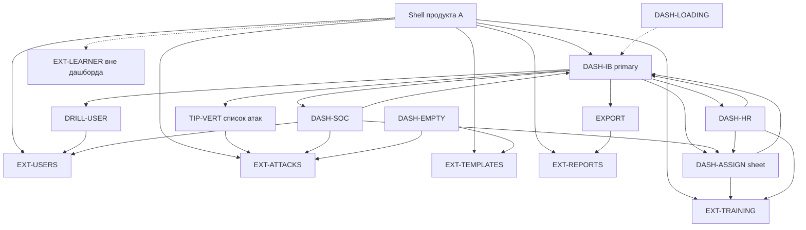

# IA — Сводный дашборд программы «А»

Навигационная истина **только для сводного дашборда** и связанных переходов.
Узла или перехода, которого нет здесь, в прототипе дашборда не существует.
Существующие разделы продукта А — **внешние узлы** (не проектируются заново).

FigJam: [UF-Portfolio · Phish](https://www.figma.com/board/apRL892T8oK9XfD7YvbCRe/UF-Portfolio?node-id=1-2).

**IA v2 (2026-10-01):** [InnoPhish · IA v2](https://www.figma.com/board/apRL892T8oK9XfD7YvbCRe/UF-Portfolio?node-id=69-289) — меню + 3 вкладки Сводки (Атаки / Реакции / Обучение); рядом UF v2 `69:414`, as-is `71:416`, Почему v2 `71:464`.

## Решения человека (зафиксированы)

1. Первый экран = **последняя кампания / актуальный срез**. Переключателя 3–6–12 месяцев на первом экране **нет**.
2. Сравнение подразделений **без** порога «плохо» / traffic-light.
3. **HR-срез** = только обучение / образование.
4. **SOC-срез** = уязвимые + частые инциденты.
5. **ФИО** топа уязвимых — на сводке (с ролевым ограничением PII).
6. **Нет** dual-mode «ИБ / руководство» на одной странице.
7. Дашборд **≠** раздел Отчёты: отдельные узлы; переход в Отчёты — внешний.
8. **График индекса (2026-09-30, UX + техспециалисты):** без TIP-A/когорты в tooltip. На графике — **серия обучения** (скрыть/показать в легенде). Hover на **вертикаль** → список атак, которые начались. → `01-research/sources/decision-chart-index-2026-09-30.md`

## 1. Модель навигации

| Слой | Роль | Вход | Выход |
|------|------|------|-------|
| Корень продукта | shell + глобальная навигация разделов А | логин / deep-link | смена раздела (внешние узлы) |
| Страница | primary дашборд ИБ или срез HR/SOC | пункт «Сводная аналитика» / роль | смена раздела; срез; экспорт; drill |
| Панель (sheet) | короткое действие в контексте | CTA «Назначить обучение» с топа/сводки | закрыть / подтвердить → остаёмся на сводке |
| Tooltip (график) | список атак на вертикали | hover на вертикаль графика | увод курсора / клик по строке → EXT-ATTACKS |
| Внешний узел | существующий раздел А | drill / CTA «в раздел» | назад в продукт (вне scope) |

Правила:
- Таббара мобильного нет: desktop shell с боковой/верхней навигацией разделов.
- Push-стек внутри дашборда минимален: primary ↔ срезы ↔ sheet. Глубокая сущность уходит во **внешний** раздел.
- Системный «назад» из sheet закрывает sheet. Из среза HR/SOC — возврат на primary (ИБ) или на shell-навигацию (если роль landится сразу в срез).
- Dual-mode toggle ИБ/руководство **запрещён**. Экспорт закрывает потребность зрителей CISO.
- Сложный hover «атака + волны + когорта» **не существует** в графе.

### Primary vs secondary

| Уровень | Узлы |
|---------|------|
| **Primary** | `DASH-IB` — сводка ИБ (актуальный срез) |
| **Secondary (срезы)** | `DASH-HR`, `DASH-SOC` |
| **Transient** | `DASH-EMPTY`, `DASH-LOADING`, `DASH-ASSIGN` (sheet), `TIP-VERT` (tooltip списка атак) |
| **Внешние** | Пользователи, Атаки, Шаблоны, Обучение, Отчёты, кабинет учащегося |

## 2. Таблица узлов

### Primary / состояния

| ID | Что это | Зачем | Когда появляется | Куда ведёт каждый интерактив |
|----|---------|-------|------------------|------------------------------|
| **DASH-IB** | Сводный дашборд ИБ: Risk Score, **график индекса** (линия + серия обучения + вертикали), атаки последней кампании, обучение, топ ФИО, подразделения, метаданные кампании, CTA, экспорт | J1–J7: одна актуальная картина без Excel | Есть ≥1 кампания (или org-срез с данными); роль ИБ / зритель с доступом к сводке | Risk Score блок → остаёмся. **Легенда графика** → toggle серии «обучение» (остаёмся). **Hover вертикаль** → **TIP-VERT**. Строка в TIP-VERT / метрика атаки → **EXT-ATTACKS**. Строка топа ФИО → **EXT-USERS** *или* CTA → **DASH-ASSIGN**. CTA «Назначить обучение» → **DASH-ASSIGN**. Блок обучения → **EXT-TRAINING**. Подразделение → остаёмся *или* **EXT-USERS** [Should]. «Экспорт» → файл *и/или* **EXT-REPORTS**. Срез HR → **DASH-HR**. Срез SOC → **DASH-SOC**. Shell → EXT-*. Нет 3–6–12. Нет TIP-A/когорты. |
| **DASH-EMPTY** | Пустое состояние сводки | Объяснить отсутствие данных и куда идти | Нет кампаний / нет данных для среза | CTA «Создать / запустить кампанию» → **EXT-ATTACKS**. CTA «К шаблонам» → **EXT-TEMPLATES**. Экспорт disabled. |
| **DASH-LOADING** | Скелетон/ожидание загрузки сводки | Не имитировать «ручную сборку» пустым UI | Пока грузятся метрики актуального среза | Интерактивов нет (или только shell). |

### Secondary срезы

| ID | Что это | Зачем | Когда | Куда |
|----|---------|-------|-------|------|
| **DASH-HR** | Срез HR: только обучение/образование | J8 | Роль HR *или* ИБ открыл срез HR | Статус обучения → **EXT-TRAINING**. Назначение → **DASH-ASSIGN** *или* **EXT-TRAINING**. «К полной сводке» → **DASH-IB**. Без Risk Score как якоря. |
| **DASH-SOC** | Срез SOC: уязвимые + частые инциденты | J9 | Роль SOC *или* ИБ открыл срез SOC | Уязвимый → **EXT-USERS**. Инцидент → **EXT-ATTACKS**. CTA обучение → **DASH-ASSIGN**. «К полной сводке» → **DASH-IB**. |

### Transient / drill

| ID | Что это | Зачем | Когда | Куда |
|----|---------|-------|-------|------|
| **DASH-ASSIGN** | Панель назначения обучения | J3, H4 | CTA с DASH-IB / DASH-SOC / (опц.) DASH-HR | Подтверждение → закрыть → DASH-* + тост. «В Обучении» → **EXT-TRAINING**. Отмена → закрыть. |
| **TIP-VERT** | Tooltip: список атак, которые **начались** на вертикали графика | Связка времени ↔ атаки без сложного hover | Hover на вертикаль на DASH-IB | Клик по строке атаки → **EXT-ATTACKS**. Увод курсора → закрыть. Без волн обучения и без когорты «с курсом / без». |
| **DRILL-ATTACK** | Маркер перехода к атаке | US13 | Тап по метрике/кампании/строке TIP-VERT | **EXT-ATTACKS**. |
| **DRILL-USER** | Переход к карточке пользователя | US13 | Тап по ФИО в топе (не CTA) | **EXT-USERS**. |
| **EXPORT** | Экспорт актуального среза | J2, J7, H3 | Кнопка «Экспорт» | Файл *или* **EXT-REPORTS** для архива/schedule. |

### Внешние узлы (не проектировать)

| ID | Раздел | Вход с дашборда |
|----|--------|-----------------|
| **EXT-USERS** | Пользователи | ФИО топа, фильтр подразделения, SOC-уязвимые |
| **EXT-ATTACKS** | Атаки | TIP-VERT, метрики кампании, SOC-инциденты, empty→создать |
| **EXT-TEMPLATES** | Шаблоны | empty-state CTA |
| **EXT-TRAINING** | Обучение | блок обучения, HR-срез, ASSIGN |
| **EXT-REPORTS** | Отчёты | экспорт→архив; shell «Отчёты» |
| **EXT-LEARNER** | Кабинет учащегося | **нет входа с дашборда** |

## 3. Граф

```mermaid
flowchart TB
  SHELL[Shell продукта А]
  SHELL --> DASH_IB[DASH-IB primary]
  SHELL --> EXT_USERS[EXT-USERS]
  SHELL --> EXT_ATTACKS[EXT-ATTACKS]
  SHELL --> EXT_TEMPLATES[EXT-TEMPLATES]
  SHELL --> EXT_TRAINING[EXT-TRAINING]
  SHELL --> EXT_REPORTS[EXT-REPORTS]
  SHELL -.-> EXT_LEARNER[EXT-LEARNER вне дашборда]

  DASH_IB --> DASH_HR[DASH-HR]
  DASH_IB --> DASH_SOC[DASH-SOC]
  DASH_HR --> DASH_IB
  DASH_SOC --> DASH_IB

  DASH_IB --> TIP_VERT[TIP-VERT список атак]
  TIP_VERT --> EXT_ATTACKS

  DASH_IB --> DASH_ASSIGN[DASH-ASSIGN sheet]
  DASH_SOC --> DASH_ASSIGN
  DASH_HR --> DASH_ASSIGN
  DASH_ASSIGN --> DASH_IB
  DASH_ASSIGN --> EXT_TRAINING

  DASH_IB --> EXPORT[EXPORT]
  EXPORT --> EXT_REPORTS

  DASH_IB --> DRILL_USER[DRILL-USER]
  DRILL_USER --> EXT_USERS
  DASH_SOC --> EXT_USERS
  DASH_SOC --> EXT_ATTACKS
  DASH_HR --> EXT_TRAINING

  DASH_EMPTY[DASH-EMPTY] --> EXT_ATTACKS
  DASH_EMPTY --> EXT_TEMPLATES
  DASH_LOADING[DASH-LOADING] -.-> DASH_IB
```

## 4. Состояния

| Состояние | Узел | Поведение |
|-----------|------|-----------|
| loading | DASH-LOADING | Скелетон Risk / график / атаки / обучение / топ |
| empty (нет кампаний) | DASH-EMPTY | CTA во внешние Атаки/Шаблоны |
| empty (нет уязвимых) | DASH-IB / DASH-SOC | Блок топа пустой; CTA обучения disabled |
| empty (обучение) | DASH-IB / DASH-HR | Нулевые статусы + EXT-TRAINING |
| legend train off | DASH-IB график | Серия обучения скрыта; вертикали и индекс остаются |
| error | DASH-* | Retry; не подменять Отчётами |
| PII denied | топ на DASH-IB | Агрегат / «недостаточно прав» |

## 5. Инварианты

1. Первый экран — актуальный срез / последняя кампания — **без** 3–6–12.
2. Нет dual-mode ИБ/руководство.
3. Дашборд ≠ Отчёты.
4. Подразделения без порога «плохо».
5. Одна сущность — один внешний экран.
6. Из ASSIGN ровно один шаг назад.
7. Кабинет учащегося вне графа.
8. Мёртвых интерактивов нет.
9. На графике: обучение = серия+легенда; атаки на вертикали = TIP-VERT; **нет** TIP-A/когорты в tooltip.

## 6. Открытые дыры навигации

1. Вход в срезы: shell vs переключатель на DASH-IB?
2. Дефолт данных: последняя кампания vs org-срез.
3. EXPORT → EXT-REPORTS: всегда опция или one-shot?
4. Тап по ФИО: сразу EXT-USERS или preview?
5. SOC «частые инциденты» (A4).
6. Матрица ролей ФИО (A2).
7. Метрика серии «обучение» на графике: completion% / число активных волн / иное — уточнить с техспециалистами.

## 7. Карта на wireframe board

| Код на доске (mobile) | Код Desktop | Узел IA |
|----------------------|-------------|---------|
| DB-IB | DB-IB-D | DASH-IB |
| DB-HR | DB-HR-D | DASH-HR |
| DB-SOC | DB-SOC-D | DASH-SOC |
| DB-EMPTY | DB-EMPTY-D | DASH-EMPTY |
| DB-LOAD | DB-LOAD-D | DASH-LOADING |
| DB-ASSIGN | DB-ASSIGN-D | DASH-ASSIGN |
| — | DB-TIP-D | TIP-VERT |
| DB-ATTACK | DB-ATTACK-D | DRILL-ATTACK → EXT-ATTACKS |

Доски: `wireframes/dashboard-wireframes.html` · `dashboard-wireframes-desktop.html` · `dashboard-ib-home-wireframe.html` · `risk-index-chart-wireframe.html` · `chart-hover-rules-wireframe.html`.
