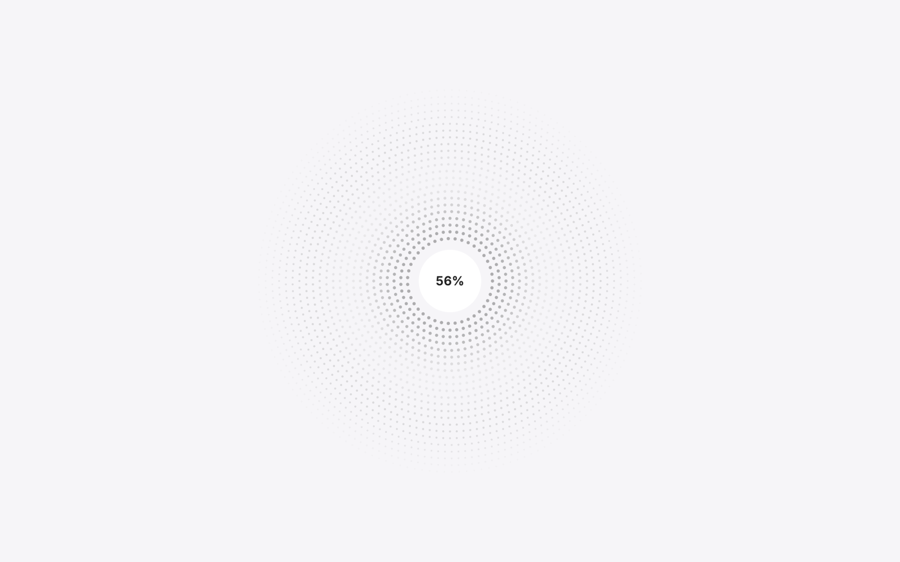
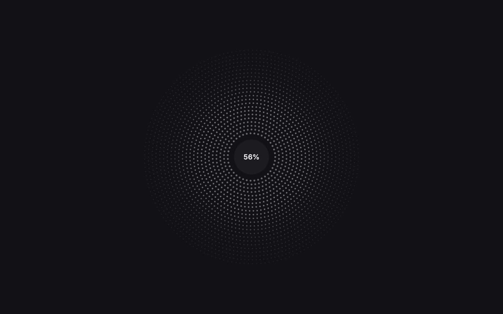
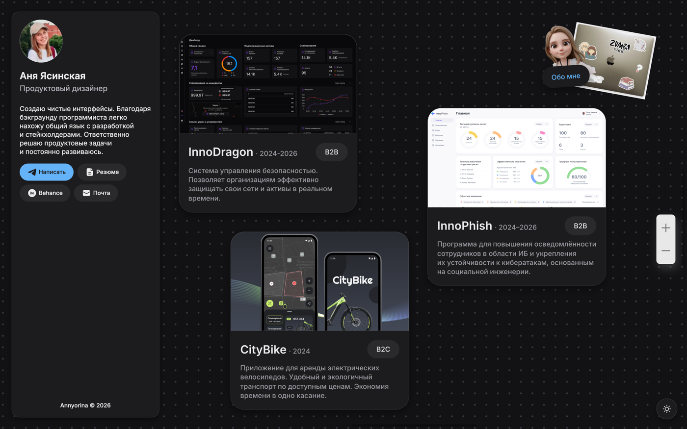

# Dots boot loader

Boot animation for the portfolio home: concentric rings of dots with a lightness
wave and a percent badge, a radial blast at 100%, and a screen-wide dot grid that
hands over to the site's own background.

| | |
|---|---|
|  |  |
| Rings hold while the page loads | The blast at 100% |

| | |
|---|---|
|  |  |
| Dark theme | …and the page underneath it |

| | |
|---|---|
|  |  |
| Mobile layout | Grid stays as the backdrop |

## Progressive images

The loader waits for light twins of the showcase images, not the originals:
`scripts/build-image-variants.mjs` builds them (`npm run build:images`) and
writes `shared/lowResImages.js`. Opaque images become JPEG, where the saving
actually is; images with transparency stay PNG and are only scaled. A twin is
kept only when it is at least 25% lighter — re-encoding an already small PNG can
produce a *bigger* file, and warming that would cost more than it saves.

Rendering code knows nothing about this. The scene builders take `resolveAsset`
as a parameter, so the wrapper in `progressiveImages.js` is injected in its
place: it hands out twin URLs and remembers the original behind each one. Once
the page is on screen `upgradeImages()` loads the originals and swaps them in
after decoding, so the change does not land as a flicker.

Measured on the dev server, cold cache: the loader hands the page over in
~0.7s instead of ~4.2s, and the first paint costs 1.7MB instead of 2.4MB.

## Modules

```
portfolio/js/bootDots.js            page wiring: classes, hand-off, progress
portfolio/js/boot/dots/config.js    tunables
portfolio/js/boot/dots/layout.js    pure geometry: grid, rings, pairing
portfolio/js/boot/dots/particles.js state buffers and per-frame drawing
portfolio/js/boot/dots/scene.js     canvas, DPR, resize, phases
portfolio/js/boot/dots/siteGrid.js  reads the live scene grid off the DOM
portfolio/js/boot/dots/assets.js    real load progress + cache warm-up
portfolio/js/boot/dots/theme.js     dark theme and its toggle
portfolio/js/progressiveImages.js   light twins first, originals after
scripts/build-image-variants.mjs    builds the twins and their manifest
```

`layout.js`, `particles.js`, `siteGrid.js` and the asset tracker never touch the
DOM directly, so they are unit-tested in `tests/test_boot_dots_*.mjs`.

## How it behaves

1. **Quiet until it matters.** Nothing is shown for the first 600ms; if the page
   is ready by then, the animation is skipped entirely — the same rule the
   existing CSS already encoded through `is-boot-slow`.
2. **Warm cache skips it.** A repeat visit is recognised before the first frame:
   a cached navigation and cached sub-resources report `transferSize: 0`. The
   threshold is then raised rather than disabled — nothing to wait for means no
   animation, but a genuinely slow load still gets the rings instead of a blank
   page.
3. **Rings.** Dots fade towards the edges and glow up as progress grows; a
   lightness wave travels outwards. The percent badge sits in the middle and the
   rings start outside it.
4. **Blast.** Dots fly outwards, overshoot, and settle into the grid. Ring
   density is set independently of grid density, so the missing dots are born
   mid-flight out of their neighbours — while everything is moving, the arrival
   does not read as popping in.
5. **Hand-over.** The settled grid matches `.scene-infinite-bg` one to one —
   step, dot radius, offset and color are read off the live element, because the
   offset depends on where the camera stood and the size on the zoom. Then the
   canvas is removed and the site's own grid, which pans with the camera, takes
   over. On mobile, where the site draws no grid, the loader paints one with a
   CSS gradient and dissolves over it.
6. **Content last.** The backdrop only lifts once the animation is over, so the
   cards never appear under flying dots.
